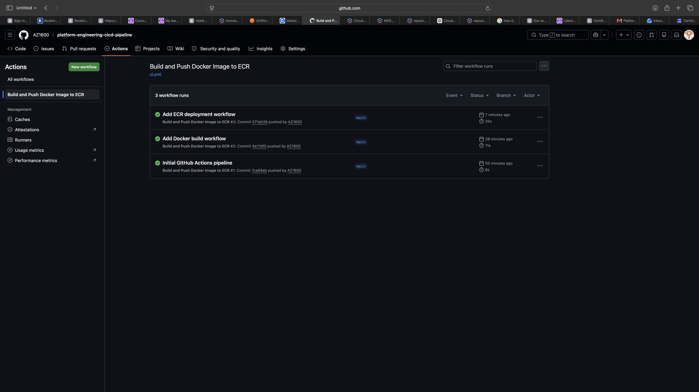
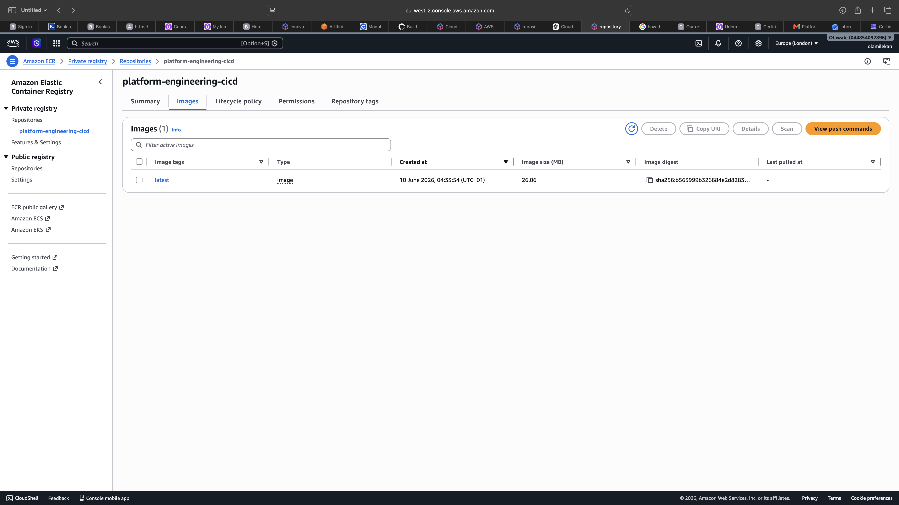

# Platform Engineering CI/CD Pipeline

## Overview

This project demonstrates a cloud-native CI/CD pipeline built using GitHub Actions, Docker, Amazon Elastic Container Registry (ECR), and AWS Identity and Access Management (IAM).

The pipeline automatically builds Docker container images and pushes them to Amazon ECR whenever code is pushed to the main branch.

This project was created to demonstrate Platform Engineering, DevOps, Cloud Engineering, and Infrastructure Automation concepts commonly used in modern software delivery environments.

---

## Architecture

Developer
↓
Git Push
↓
GitHub Actions
↓
Docker Image Build
↓
AWS Authentication
↓
Amazon ECR Login
↓
Docker Image Push
↓
Amazon ECR Repository

---

## Technologies Used

* GitHub Actions
* Docker
* Amazon ECR
* AWS IAM
* Git
* GitHub
* Linux

---

## Features

* Automated CI/CD pipeline
* Docker image creation
* Secure AWS authentication using GitHub Secrets
* Amazon ECR integration
* Automated container image publishing
* Infrastructure automation principles

---

## CI/CD Workflow

The GitHub Actions workflow performs the following tasks:

1. Checks out the repository source code.
2. Authenticates with AWS using GitHub Secrets.
3. Logs into Amazon Elastic Container Registry (ECR).
4. Builds a Docker image from the Dockerfile.
5. Tags the Docker image.
6. Pushes the image to Amazon ECR automatically.

---

## AWS Services Used

### Amazon ECR

Stores Docker container images for deployment.

### AWS IAM

Provides secure authentication and authorization for GitHub Actions.

---

## Skills Demonstrated

* Continuous Integration (CI)
* Continuous Delivery (CD)
* GitHub Actions
* Docker
* Amazon ECR
* AWS IAM
* Secrets Management
* Platform Engineering
* DevOps Practices
* Cloud Automation

---

## Screenshots

### GitHub Actions Pipeline Success

### Amazon ECR Repository

---

## Future Enhancements

* Deploy Docker images directly to Amazon EKS
* Kubernetes deployment automation
* Infrastructure provisioning using Terraform
* Monitoring and observability integration
* Automated testing stages
* Multi-environment deployments

---

## Author

Olawale Azeez

AWS Certified Solutions Architect – Associate

AWS Certified Cloud Practitioner

Aspiring Platform Engineer | Cloud Engineer | DevOps Engineer
