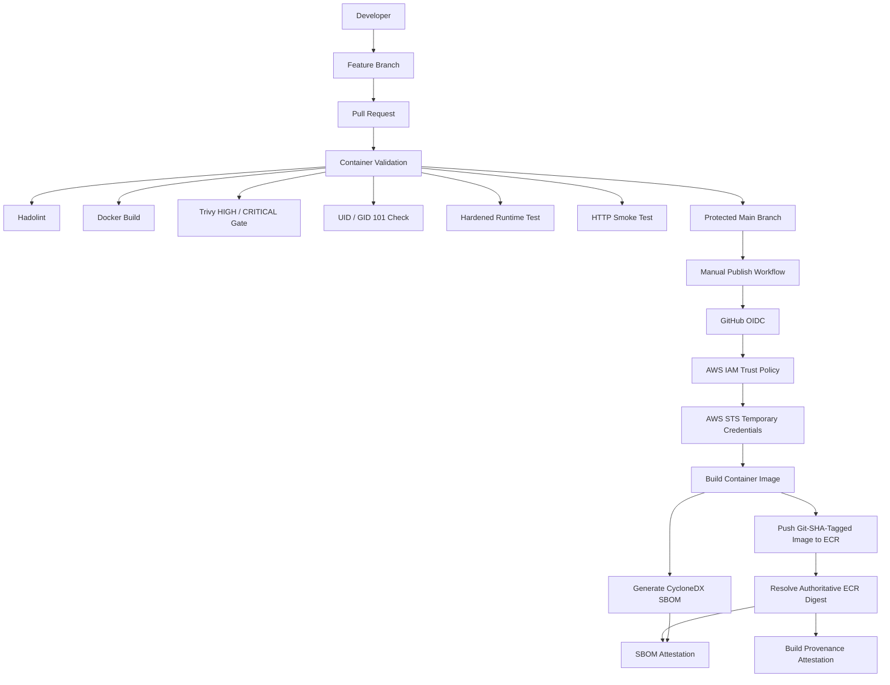
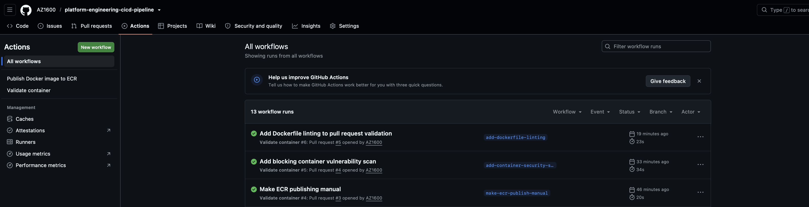
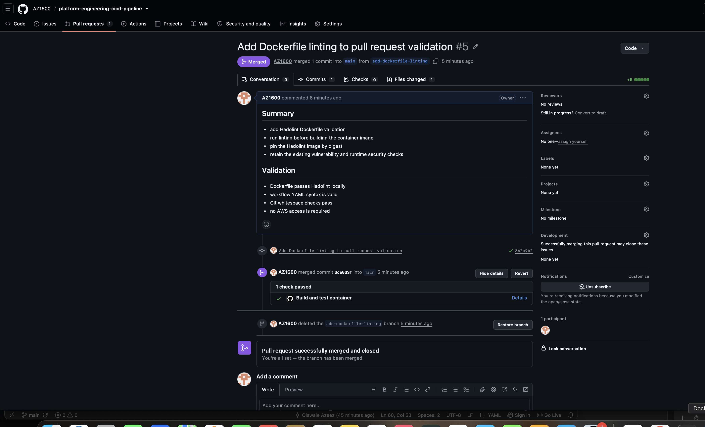
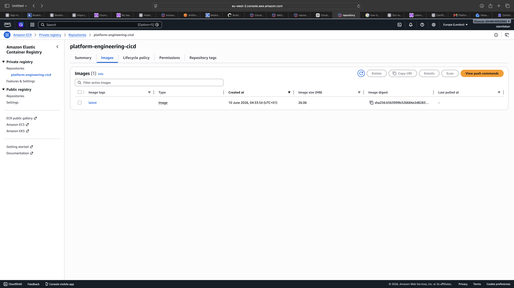

# Platform Engineering CI/CD Pipeline

[](https://github.com/AZ1600/platform-engineering-cicd-pipeline/actions/workflows/validate-container.yml)

## Overview

This project demonstrates a security-focused container CI/CD workflow built
with GitHub Actions, Docker, Hadolint, Trivy, Amazon Elastic Container Registry
(ECR), AWS IAM, GitHub OpenID Connect, CycloneDX SBOMs, and signed artifact
attestations.

Pull requests are validated before merge through Dockerfile linting, container
builds, vulnerability scanning, non-root verification, hardened runtime testing,
and an HTTP smoke test.

Publishing is intentionally separated from pull-request validation.

A manually triggered workflow on `main`:

1. authenticates to AWS using GitHub OIDC
2. receives short-lived AWS STS credentials
3. builds the container
4. generates a CycloneDX SBOM
5. validates and uploads the SBOM
6. publishes the image to Amazon ECR using the Git commit SHA
7. queries ECR for the authoritative image digest
8. creates signed build provenance
9. creates a signed SBOM attestation

No long-lived AWS access keys are required by the publishing workflow.

---

## Architecture


```mermaid
flowchart TD
    DEV["Developer"] --> BRANCH["Feature Branch"]
    BRANCH --> PR["Pull Request"]

    PR --> VALIDATE["Container Validation"]

    VALIDATE --> LINT["Hadolint"]
    VALIDATE --> BUILDTEST["Docker Build"]
    VALIDATE --> TRIVY["Trivy HIGH / CRITICAL Gate"]
    VALIDATE --> USER["UID / GID 101 Check"]
    VALIDATE --> HARDEN["Hardened Runtime Test"]
    VALIDATE --> SMOKE["HTTP Smoke Test"]

    VALIDATE --> MAIN["Protected Main Branch"]

    MAIN --> PUBLISH["Manual Publish Workflow"]

    PUBLISH --> OIDC["GitHub OIDC"]
    OIDC --> IAM["AWS IAM Trust Policy"]
    IAM --> STS["AWS STS Temporary Credentials"]

    STS --> BUILD["Build Container Image"]
    BUILD --> SBOM["Generate CycloneDX SBOM"]
    BUILD --> ECR["Push Git-SHA-Tagged Image to ECR"]

    ECR --> DIGEST["Resolve Authoritative ECR Digest"]

    DIGEST --> PROVENANCE["Build Provenance Attestation"]
    DIGEST --> SBOMATT["SBOM Attestation"]
    SBOM --> SBOMATT
```

---

## Pull-Request Validation

The workflow:

    .github/workflows/validate-container.yml

runs for pull requests and can also be triggered manually.

It performs the following checks:

1. Checks out the repository using a commit-pinned GitHub Action.
2. Lints the Dockerfile with digest-pinned Hadolint.
3. Builds the container image.
4. Scans the image with digest-pinned Trivy.
5. Blocks fixed HIGH and CRITICAL vulnerabilities.
6. Verifies the configured runtime UID is `101`.
7. Verifies the configured runtime GID is `101`.
8. Starts the image with a read-only root filesystem.
9. Drops all Linux capabilities.
10. Enables `no-new-privileges`.
11. Provides a restricted memory-backed `/tmp`.
12. Performs an HTTP smoke test.
13. Displays container logs when runtime validation fails.
14. Removes the test container even after failures.

The workflow uses:

    ubuntu-24.04

rather than `ubuntu-latest` to avoid unexpected runner migrations.

---

## Amazon ECR Publishing

The publishing workflow is:

    .github/workflows/ci.yml

and runs only through:

    workflow_dispatch

The publishing sequence is:

```text
Git commit on main
        |
        v
GitHub Actions
        |
        v
GitHub OIDC token
        |
        v
AWS IAM trust validation
        |
        v
AWS STS temporary credentials
        |
        v
Build container image
        |
        +------------------------+
        |                        |
        v                        v
CycloneDX SBOM             Amazon ECR
                                 |
                                 v
                         immutable Git-SHA tag
                                 |
                                 v
                       authoritative image digest
                                 |
                    +------------+------------+
                    |                         |
                    v                         v
             build provenance          SBOM attestation
               attestation
```

---

## GitHub OIDC and AWS Authentication

The project does not require stored:

    AWS_ACCESS_KEY_ID
    AWS_SECRET_ACCESS_KEY

for ECR publishing.

Instead, GitHub Actions requests an OIDC token and exchanges it with AWS STS.

The trust policy restricts role assumption to:

    repo:AZ1600/platform-engineering-cicd-pipeline:ref:refs/heads/main

The IAM role used by GitHub Actions is:

    GitHubActionsPlatformCicdEcrPublisher

The workflow also validates the AWS account ID during credential configuration.

This creates multiple security boundaries:

```text
GitHub repository
        |
        v
main branch
        |
        v
GitHub OIDC
        |
        v
AWS IAM trust policy
        |
        v
temporary STS credentials
        |
        v
repository-scoped ECR permissions
```

---

## Least-Privilege IAM

The publishing role is allowed to authenticate to ECR and publish only to the
dedicated repository:

    arn:aws:ecr:eu-west-2:808101329332:repository/platform-engineering-cicd

Repository-scoped actions include:

    ecr:BatchCheckLayerAvailability
    ecr:CompleteLayerUpload
    ecr:DescribeImages
    ecr:InitiateLayerUpload
    ecr:PutImage
    ecr:UploadLayerPart

`ecr:GetAuthorizationToken` requires:

    Resource: "*"

but the image publishing permissions remain scoped to the dedicated repository.

The IAM policy definitions are stored under:

    aws/

---

## Container Security

The application uses the official unprivileged NGINX image:

```dockerfile
FROM nginxinc/nginx-unprivileged:1.30.5-alpine3.24@sha256:15c994d10d6d78658721c3bcafff14cb281fba2a4bdf9d5ba92c416a472516e3

COPY --chown=101:101 src/ /usr/share/nginx/html/

USER 101:101

EXPOSE 8080
```

The base image is pinned by digest for reproducibility.

The CI pipeline also proves that the container continues to work while running
with additional restrictions.

The runtime validation uses:

    read-only root filesystem
    cap-drop ALL
    no-new-privileges
    UID 101
    GID 101
    restricted tmpfs

---

## Vulnerability Management

The validation workflow scans the built image using Trivy.

The blocking policy is:

    HIGH
    CRITICAL

with:

    --ignore-unfixed
    --exit-code 1

This means fixed HIGH or CRITICAL findings cause CI to fail.

During development, the previously pinned NGINX base image developed
fixable vulnerabilities.

The security gate correctly blocked the pipeline.

The base image was intentionally refreshed and the complete application was
revalidated rather than weakening the Trivy policy.

The refreshed image produced:

    0 blocking HIGH/CRITICAL vulnerabilities

during validation.

Amazon ECR also performs scan-on-push after publication.

---

## Immutable Image Publishing

Images are tagged using:

    ${{ github.sha }}

rather than:

    latest

For example:

    ebdc23381190227e46d84259be746b106c33b19c

The ECR repository also uses immutable tags.

This creates a traceable relationship:

```text
Git source commit
        |
        v
GitHub Actions workflow
        |
        v
ECR Git-SHA image tag
        |
        v
immutable container digest
```

A published Git commit tag cannot later be replaced with different image
contents.

---

## Authoritative ECR Digest Resolution

After the Docker image is pushed, the workflow does not parse the
human-readable `docker push` output.

Instead, it asks Amazon ECR directly:

    aws ecr describe-images

using the Git commit SHA tag.

The returned value must match:

    sha256:<64 hexadecimal characters>

before it can be used for attestations.

This prevents malformed or incorrectly parsed values from becoming
security-sensitive artifact metadata.

---

## Software Bill of Materials

The workflow generates a CycloneDX SBOM from the actual built container image.

This is important because the container contains dependencies inherited from
the operating-system and NGINX layers that do not appear directly in the
application source tree.

The successful validated workflow produced a CycloneDX SBOM containing:

    71 components

The SBOM is also uploaded as a GitHub Actions artifact.

For the validated run, the artifact was named:

    sbom-ebdc23381190227e46d84259be746b106c33b19c

---

## Build Provenance

The workflow creates build provenance for the immutable ECR artifact.

The successfully validated artifact used the digest:

    sha256:2373ce5dd52054f67b2ee81eff4028c09daf7c092e85baedbbd5f1c47753b260

The provenance answers:

    Which workflow produced this exact artifact?

The successful GitHub provenance attestation ID was:

    52871120

---

## SBOM Attestation

The same immutable ECR digest is also associated with the CycloneDX SBOM.

The SBOM attestation answers:

    What components were recorded for this exact artifact?

The successful GitHub SBOM attestation ID was:

    52871128

Both attestations were signed using Sigstore infrastructure and recorded in the
Rekor transparency log.

---

## Supply-Chain Evidence Model

The completed workflow can answer several different questions.

### Who authenticated to AWS?

GitHub Actions through OIDC and AWS STS.

### Which source revision produced the image?

The Git commit SHA used as the ECR image tag.

### What exact artifact was published?

The immutable Amazon ECR SHA-256 digest.

### What components are inside it?

The CycloneDX SBOM.

### Where did the artifact come from?

The build provenance attestation.

### Is there signed evidence?

Yes. GitHub artifact attestations are signed and transparency-log recorded.

---

## Security Controls

The repository demonstrates:

- protected `main` workflow
- pull-request validation
- minimal GitHub Actions permissions
- GitHub OIDC authentication
- short-lived AWS STS credentials
- AWS account validation
- branch-scoped IAM trust
- least-privilege ECR permissions
- commit-pinned external GitHub Actions
- digest-pinned Hadolint
- digest-pinned Trivy
- digest-pinned NGINX base image
- explicit Ubuntu 24.04 GitHub runner
- non-root containers
- read-only runtime testing
- dropped Linux capabilities
- `no-new-privileges`
- restricted `tmpfs`
- HIGH/CRITICAL vulnerability gating
- ECR scan-on-push
- AES256 ECR encryption
- immutable ECR tags
- Git-SHA image tags
- CycloneDX SBOM generation
- SBOM validation
- SBOM artifact retention
- authoritative ECR digest lookup
- build provenance attestation
- SBOM attestation
- Sigstore signing
- transparency-log recording

---

## Repository Structure

```text
platform-engineering-cicd-pipeline/
├── .github/
│   └── workflows/
│       ├── ci.yml
│       └── validate-container.yml
├── aws/
│   ├── ecr-publish-policy.json
│   └── github-oidc-trust-policy.json
├── docs/
│   ├── screenshots/
│   │   ├── container-validation-success.png
│   │   ├── ecr-image.png
│   │   └── github-actions-success.png
│   └── troubleshooting.md
├── src/
│   └── index.html
├── .dockerignore
├── .gitignore
├── Dockerfile
└── README.md
```

---

## Technologies

- GitHub Actions
- GitHub OIDC
- Docker
- Hadolint
- Trivy
- CycloneDX
- Sigstore
- Rekor
- NGINX
- Amazon ECR
- AWS IAM
- AWS STS
- AWS CLI
- Git
- GitHub
- Linux

---

## Run Locally

### Prerequisites

Install:

- Git
- Docker Desktop

### Build

```bash
docker build --tag platform-cicd:local .
```

### Verify the Runtime User

```bash
docker run --rm platform-cicd:local id -u
docker run --rm platform-cicd:local id -g
```

Expected:

```text
101
101
```

### Start the Hardened Container

```bash
docker run \
  --detach \
  --name platform-cicd-local \
  --publish 8080:8080 \
  --read-only \
  --cap-drop ALL \
  --security-opt no-new-privileges:true \
  --tmpfs /tmp:rw,noexec,nosuid,size=16m \
  platform-cicd:local
```

### Smoke Test

```bash
curl \
  --fail \
  --silent \
  --show-error \
  http://localhost:8080
```

The application should return content containing:

    Platform Engineering CI/CD Pipeline

### Remove the Container

```bash
docker rm --force platform-cicd-local
```

---

## Validate Locally

### Dockerfile Linting

```bash
docker run --rm -i \
  hadolint/hadolint@sha256:32dac94127fd60b7b7e3fbfc65e1383b9b5e25c9bfd7b8536de7a539fe68a12d \
  < Dockerfile
```

No output means the enabled Hadolint rules passed.

### Build a Validation Image

```bash
docker build --tag platform-cicd:test .
```

### Vulnerability Scan

```bash
docker run --rm \
  --volume /var/run/docker.sock:/var/run/docker.sock \
  aquasec/trivy:0.73.0@sha256:7cced7cae583819fc7806d4cbc0dbbc7cad18b99f7d3e235192e6da8c091045c \
  image \
  --scanners vuln \
  --severity HIGH,CRITICAL \
  --ignore-unfixed \
  --exit-code 1 \
  --skip-version-check \
  platform-cicd:test
```

An exit code of `0` means no vulnerability matched the blocking policy.

### Generate a Local CycloneDX SBOM

```bash
docker run --rm \
  --volume /var/run/docker.sock:/var/run/docker.sock \
  --volume "$PWD:/workspace" \
  aquasec/trivy:0.73.0@sha256:7cced7cae583819fc7806d4cbc0dbbc7cad18b99f7d3e235192e6da8c091045c \
  image \
  --format cyclonedx \
  --output /workspace/sbom.cdx.json \
  --skip-version-check \
  platform-cicd:test
```

Validate the JSON:

```bash
python3 -m json.tool sbom.cdx.json >/dev/null \
  && echo "SBOM JSON valid"
```

Remove the local generated artifact afterward:

```bash
rm sbom.cdx.json
```

---

## Screenshots

### GitHub Actions

The repository contains evidence of successful GitHub Actions workflow
validation.



### Protected Pull-Request Validation

The repository contains evidence of a pull request passing the container
validation workflow before merge.



### Amazon ECR

The repository contains evidence of a published Amazon ECR container image.



---

## Troubleshooting

A detailed engineering record of real failures and their resolutions is kept in:

    docs/troubleshooting.md

Topics include:

- stale AWS account configuration
- missing ECR repositories
- GitHub OIDC migration
- least-privilege IAM
- vulnerable digest-pinned base images
- Trivy security-gate failures
- ECR digest resolution
- CI side effects after failed jobs
- eventual consistency
- GitHub workflow-run discovery races
- successful SBOM and provenance validation

---

## Skills Demonstrated

- Platform Engineering
- Cloud Engineering
- CI/CD architecture
- DevSecOps
- GitHub Actions
- AWS IAM
- GitHub OIDC
- AWS STS
- Amazon ECR
- Docker security
- Container vulnerability management
- Least-privilege access design
- Software supply-chain security
- CycloneDX SBOM generation
- Build provenance
- Artifact attestations
- Immutable release practices
- Runtime hardening
- Troubleshooting and root-cause analysis

---

## Current Scope

This project focuses on secure container validation and artifact publication.

The published container is a small static NGINX application used to demonstrate
the delivery controls.

It does not currently deploy the image automatically to ECS, EKS, or another
runtime.

That separation is intentional: the repository demonstrates the build,
validation, identity, security, publication, and artifact-evidence stages
without pretending to be a production application deployment platform.

---

## Potential Next Steps

Possible future extensions include:

- deploy the validated image to Amazon ECS or EKS
- verify attestations before deployment
- add deployment environments and approvals
- manage AWS resources with Terraform
- add automated dependency update workflows
- add deployment rollback controls
- add deployment health verification
- integrate runtime observability
- enforce artifact verification as a deployment admission requirement

---

## Author

Olawale Azeez

Cloud & Platform Engineer

AWS • Azure • Kubernetes • Terraform • CI/CD • DevSecOps • Observability
