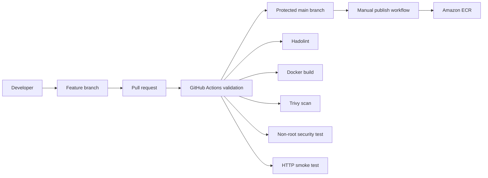

# Platform Engineering CI/CD Pipeline

[](https://github.com/AZ1600/platform-engineering-cicd-pipeline/actions/workflows/validate-container.yml)

## Overview

This project demonstrates a secure container CI/CD workflow built with GitHub Actions, Docker, Hadolint, Trivy, Amazon Elastic Container Registry (ECR), and AWS Identity and Access Management (IAM).

Every pull request is validated before it can be merged into the protected `main` branch. The workflow lints the Dockerfile, builds the image, scans it for vulnerabilities, verifies that it runs as a non-root user, starts it with additional runtime restrictions, and performs an HTTP smoke test.

Publishing to Amazon ECR is currently a separate, manually triggered workflow. This allows pull-request validation to run without AWS access while preventing failed or accidental publishing attempts.

## Architecture


```mermaid
flowchart LR
    DEV["Developer"] --> BRANCH["Feature branch"]
    BRANCH --> PR["Pull request"]
    PR --> CI["GitHub Actions validation"]
    CI --> PROTECTED["Protected main branch"]
    PROTECTED --> MANUAL["Manual publish workflow"]
    MANUAL --> ECR["Amazon ECR"]

    CI --> LINT["Hadolint"]
    CI --> BUILD["Docker build"]
    CI --> SCAN["Trivy scan"]
    CI --> SECURITY["Non-root security test"]
    CI --> SMOKE["HTTP smoke test"]
```

## CI/CD Flow

### Pull-request validation

The workflow in `.github/workflows/validate-container.yml` runs for pull requests and can also be started manually.

It performs the following checks:

1. Checks out the repository with a commit-pinned GitHub Action.
2. Lints the Dockerfile using Hadolint.
3. Builds the container image.
4. Scans the image with Trivy.
5. Blocks the workflow when fixed `HIGH` or `CRITICAL` vulnerabilities are detected.
6. Confirms that the image uses UID and GID `101`.
7. Starts the container with a read-only filesystem.
8. Drops all Linux capabilities.
9. Enables `no-new-privileges`.
10. Provides a restricted temporary filesystem.
11. Sends an HTTP request and verifies the expected application response.
12. Collects container logs after runtime failures.
13. Removes the test container even when a previous step fails.

### ECR publishing

The workflow in `.github/workflows/ci.yml` publishes the image to Amazon ECR only when manually triggered with `workflow_dispatch`.

AWS access is not required for pull-request validation. Valid AWS configuration is required only when the ECR publishing workflow is started.

## Security Controls

The project applies multiple build-time and runtime controls:

- Protected `main` branch
- Pull-request validation before merging
- Minimal GitHub Actions permissions
- Commit-pinned external GitHub Action
- Digest-pinned Hadolint image
- Digest-pinned Trivy image
- Digest-pinned NGINX base image
- Non-root NGINX process using UID and GID `101`
- Read-only container filesystem during testing
- All Linux capabilities removed
- `no-new-privileges` enabled
- Restricted memory-backed `/tmp`
- HIGH and CRITICAL vulnerability blocking
- Limited Docker build context through `.dockerignore`
- Manual separation of AWS publishing from pull-request CI

## Container Hardening

The Docker image uses the official unprivileged NGINX image and serves the application on port `8080`.

```dockerfile
FROM nginxinc/nginx-unprivileged:1.30.4-alpine@sha256:44e36330f74d4f3a1d4e222acca9e23b401fb87811a7597024502bb759c4dd49
