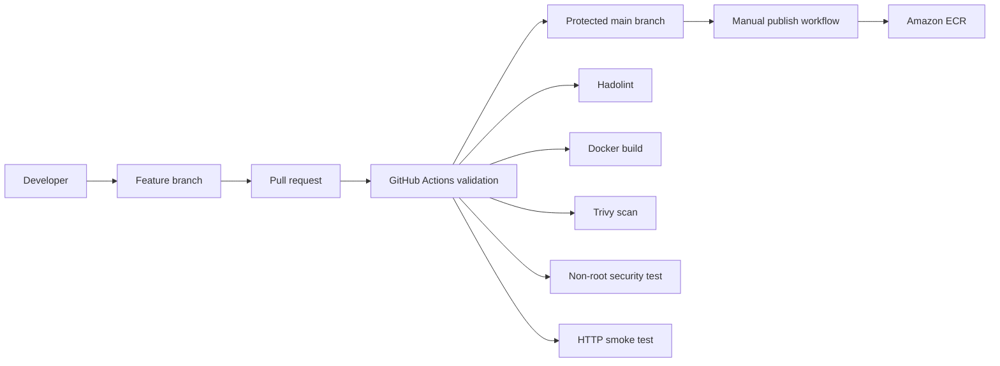

# Platform Engineering CI/CD Pipeline

[](https://github.com/AZ1600/platform-engineering-cicd-pipeline/actions/workflows/validate-container.yml)

## Overview

This project demonstrates a secure container CI/CD workflow built with GitHub Actions, Docker, Hadolint, Trivy, Amazon Elastic Container Registry (ECR), and AWS Identity and Access Management (IAM).

Every pull request is validated before it can be merged into the protected `main` branch. The workflow lints the Dockerfile, builds the image, scans it for vulnerabilities, verifies that it runs as a non-root user, starts it with additional runtime restrictions, and performs an HTTP smoke test.

Publishing to Amazon ECR is currently a separate, manually triggered workflow. This allows pull-request validation to run without AWS access while preventing failed or accidental publishing attempts.

## Architecture


```mermaid
flowchart LR
    DEV["Developer"] --> BRANCH["Feature branch"]
    BRANCH --> PR["Pull request"]
    PR --> CI["GitHub Actions validation"]
    CI --> PROTECTED["Protected main branch"]
    PROTECTED --> MANUAL["Manual publish workflow"]
    MANUAL --> ECR["Amazon ECR"]

    CI --> LINT["Hadolint"]
    CI --> BUILD["Docker build"]
    CI --> SCAN["Trivy scan"]
    CI --> SECURITY["Non-root security test"]
    CI --> SMOKE["HTTP smoke test"]
```

## CI/CD Flow

### Pull-request validation

The workflow in `.github/workflows/validate-container.yml` runs for pull requests and can also be started manually.

It performs the following checks:

1. Checks out the repository with a commit-pinned GitHub Action.
2. Lints the Dockerfile using Hadolint.
3. Builds the container image.
4. Scans the image with Trivy.
5. Blocks the workflow when fixed `HIGH` or `CRITICAL` vulnerabilities are detected.
6. Confirms that the image uses UID and GID `101`.
7. Starts the container with a read-only filesystem.
8. Drops all Linux capabilities.
9. Enables `no-new-privileges`.
10. Provides a restricted temporary filesystem.
11. Sends an HTTP request and verifies the expected application response.
12. Collects container logs after runtime failures.
13. Removes the test container even when a previous step fails.

### ECR publishing

The workflow in `.github/workflows/ci.yml` publishes the image to Amazon ECR only when manually triggered with `workflow_dispatch`.

AWS access is not required for pull-request validation. Valid AWS configuration is required only when the ECR publishing workflow is started.

## Security Controls

The project applies multiple build-time and runtime controls:

- Protected `main` branch
- Pull-request validation before merging
- Minimal GitHub Actions permissions
- Commit-pinned external GitHub Action
- Digest-pinned Hadolint image
- Digest-pinned Trivy image
- Digest-pinned NGINX base image
- Non-root NGINX process using UID and GID `101`
- Read-only container filesystem during testing
- All Linux capabilities removed
- `no-new-privileges` enabled
- Restricted memory-backed `/tmp`
- HIGH and CRITICAL vulnerability blocking
- Limited Docker build context through `.dockerignore`
- Manual separation of AWS publishing from pull-request CI

## Container Hardening

The Docker image uses the official unprivileged NGINX image and serves the application on port `8080`.

```dockerfile
FROM nginxinc/nginx-unprivileged:1.30.4-alpine@sha256:44e36330f74d4f3a1d4e222acca9e23b401fb87811a7597024502bb759c4dd49

COPY --chown=101:101 src/ /usr/share/nginx/html/

USER 101:101

EXPOSE 8080
```

Pinning the base image by digest makes builds reproducible. Running as a non-root user and testing with restricted runtime permissions reduces the potential impact of a compromised container process.

## Repository Structure

```text
platform-engineering-cicd-pipeline/
├── .github/
│   └── workflows/
│       ├── ci.yml
│       └── validate-container.yml
├── docs/
│   └── screenshots/
│       ├── container-validation-success.png
│       ├── ecr-image.png
│       └── github-actions-success.png
├── src/
│   └── index.html
├── .dockerignore
├── .gitignore
├── Dockerfile
└── README.md
```

## Technologies

- GitHub Actions
- Docker
- Hadolint
- Trivy
- NGINX
- Amazon ECR
- AWS IAM
- Git and GitHub
- Linux

## Run Locally

### Prerequisites

- Git
- Docker Desktop

### Build the image

```bash
docker build --tag platform-cicd:local .
```

### Verify the configured user

```bash
docker image inspect platform-cicd:local \
  --format 'Configured user: {{.Config.User}}'
```

Expected result:

```text
Configured user: 101:101
```

### Run the hardened container

```bash
docker run \
  --detach \
  --name platform-cicd-local \
  --publish 8080:8080 \
  --read-only \
  --cap-drop ALL \
  --security-opt no-new-privileges:true \
  --tmpfs /tmp:rw,noexec,nosuid,size=16m \
  platform-cicd:local
```

Open [http://localhost:8080](http://localhost:8080) or test it from the terminal:

```bash
curl --fail http://localhost:8080
```

### Remove the local container

```bash
docker rm --force platform-cicd-local
```

## Validate Locally

### Lint the Dockerfile

```bash
docker run --rm -i \
  hadolint/hadolint@sha256:32dac94127fd60b7b7e3fbfc65e1383b9b5e25c9bfd7b8536de7a539fe68a12d \
  < Dockerfile
```

No output means the Dockerfile passed the enabled Hadolint rules.

### Scan the container image

Build the test image:

```bash
docker build --tag platform-cicd:test .
```

Run Trivy:

```bash
docker run --rm \
  --volume /var/run/docker.sock:/var/run/docker.sock \
  aquasec/trivy:0.73.0@sha256:7cced7cae583819fc7806d4cbc0dbbc7cad18b99f7d3e235192e6da8c091045c \
  image \
  --scanners vuln \
  --severity HIGH,CRITICAL \
  --ignore-unfixed \
  --exit-code 1 \
  --skip-version-check \
  platform-cicd:test
```

An exit code of `0` means no matching vulnerability caused the security gate to fail.

## Evidence

### Successful GitHub Actions workflows

The recent workflow runs show successful Dockerfile linting, vulnerability scanning, and pull-request container validation.


### Protected pull request validation

This pull request passed the required container validation check before being merged into `main`.


### Amazon ECR image

The repository includes evidence of a previously published container image in Amazon ECR.


## Skills Demonstrated

- Continuous integration
- Container build automation
- Dockerfile linting
- Container vulnerability management
- Secure container configuration
- GitHub Actions workflow design
- Pull-request and branch protection
- Amazon ECR integration
- AWS IAM integration
- Reproducible dependency pinning
- Runtime smoke testing
- Platform engineering practices

## Current Limitations

- ECR publishing requires valid AWS access and is manually triggered.
- The publishing workflow still needs migration from long-lived AWS credentials to GitHub OpenID Connect.
- The project currently deploys a static NGINX application rather than a production service.
- No automated deployment to ECS, EKS, or another runtime is currently configured.

## Future Improvements

- Replace AWS access keys with GitHub OIDC and short-lived credentials.
- Tag ECR images with the Git commit SHA instead of relying only on `latest`.
- Generate and publish a Software Bill of Materials.
- Add image signing and provenance attestations.
- Deploy the validated image to Amazon ECS or EKS.
- Provision AWS infrastructure with Terraform.
- Add staging and production environments with approvals.
- Add Dependabot for GitHub Actions and container dependencies.
- Introduce monitoring, logging, and deployment health checks.

## Author

Olawale Azeez

AWS Certified Solutions Architect – Associate  
AWS Certified Cloud Practitioner

Aspiring Platform Engineer | Cloud Engineer | DevOps Engineer